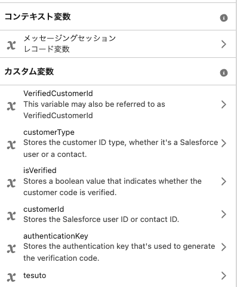

# salesforce-web-app
Salesforceの環境情報を取得して表示するwebアプリです。

# 各種手順
今回環境の制限によりAgentAPIの呼び出しを実現する環境がなくなってしまいました。  
接続アプリケーションの作成を行っていた環境にアクセスできなくなり、25Summerで新規で接続アプリケーションを作成できないため、（外部クライアントアプリケーションしか作成できなくなった）  
AgentAPIを呼び出す手段がない状況です・・・  
基本的な手順だけ紹介して余った時間はAgentforceのApexについて説明します。  
現在Agentforce Service Agent(ASA)のみ使用できそうですが、クライアント認証フローをサポートする接続アプリケーションのみ対応しています。

## 手順全量
https://developer.salesforce.com/docs/einstein/genai/guide/agent-api.html

### 外部クライアントアプリの作成
まずは専用の接続アプリケーションを作成します。最近外部クライアントアプリケーションに名前変わりました。

設定＞外部クライアントアプリケーションマネージャーから新規外部クライアントアプリケーションを作成します。  
アプリ名はなんでも構いません。今回はAgentAPIとします。

以下の設定を行います。

外部クライアントアプリケーション名：AgentAPI2  
API参照名：AgentAPI2   
取引先責任者名：適当なメールアドレス  
OAuth設定：有効にします 

スコープ：
* API を使用してユーザーデータを管理 (api)
* いつでも要求を実行 (refresh_token, offline_access)
* チャットボットサービスにアクセス (chatbot_api)
* Salesforce API プラットフォームにアクセス (sfap_api)

セキュリティ
* Web サーバーフローの秘密が必要 のチェックを外す
* 更新トークンフローの秘密が必要 のチェックを外す
* サポートされる認証フローに Proof Key for Code Exchange (PKCE) 拡張を要求 のチェックを外す

フローの有効化
* クライアントログイン情報フローを有効化　にチェックを入れる
* 指名ユーザーの JSON Web トークン (JWT) ベースのアクセストークンを発行 にチェックを入れる

上記設定後にアプリを保存します。アプリ保存後にポリシーを編集から以下を行います。

OAuthポリシー
* 管理者が承認したユーザは事前承認済みを選択
* 特定のプロファイルや権限セットを持ったユーザのみ指定する

OAuth フローおよび外部クライアントアプリケーションの機能強化
* クライアントログイン情報フローを有効化にチェックを入れる /
ユーザを指定して実行する（特定のAPIのみ使用できるユーザを指定）

指定ユーザーの JWT ベースのアクセストークン設定
* トークンタイムアウト30分を指定

### Agentforceの有効化
設定＞Agentforceエージェントを開き、右上のAgentforceにチェックを入れます。
もし出ない場合は、設定＞Einstein設定　からEinsteinを有効化にチェックを入れます。

Agent：EnterpriseServiceAgentを作成します。

Topic:Service

AgentDemo

Deliver personalized customer interactions with an autonomous AI agent. Agentforce Service Agent intelligently supports your customers with common inquiries and escalates complex issues.

商談に関連するタスクや説明情報を管理し、商談の進捗を支援します。

私の会社はCRMとしてSalesforceを利用しており、商談に紐づく会議情報や進捗情報などからネクストアクションを整理する仕組みを構築しています。

構築したエージェントのところから接続で外部アプリケーションを追加します。

# プロンプトの作成方法

API作成のプロンプトの作成には以下の様な情報が必要です。

* APIの形式（REST,SOAP,Stream,ConnectREST,ApexREST,ApexSOAP,UserInterfaceAPI,ToolingAPI,MetaDataAPI,BulkAPI,PubSubAPI等）
* 認証形式、アクセストークン、リフレッシュトークンの取得処理
* 個別APIの実装

ドキュメント等あればそれを読み込ませて実装させることができますが、具体的に書いて渡したほうが手戻りは少ないです。
Agent APIでは以下のようなプロンプトで実装すると良いかもしれません。
routesについてはAPIごとに分けているほうがソースが分かれて可読性が高まるので、分けて実装する形とします。

## OAuth
基本的なOAuth認証によるアクセストークン、リフレッシュトークン取得についてです。
クライアントログイン情報フローだとユーザ名やユーザパスワード情報は不要ですが、
UIセッションがサポートされないのでリフレッシュトークンは取得されません。

### format
REST API

### endpoint
production: https://{MY_DOMAIN}/services/oauth2/token  
sandbox: https://{MY_DOMAIN}/services/oauth2/token  

### method
HTTPmethod: POST

### header
Content-Type: application//x-www-form-urlencoded   
grant_type=client_credentials   
client_id={CLIENT_ID}  
client_secret={CLIENT_SECRET}  
※秘密情報はコード上には記載せず環境変数から取得する様にしてください。

## StartSession
以下の形式での実装としてください。  
アクセストークン、リフレッシュトークンを取得する処理は共通化してください。   
{変数}の箇所については環境変数から取得してください  

### format
REST API

### endpoint
production: https://api.salesforce.com/einstein/ai-agent/v1/agents/{AGENT_ID}/sessions  
sandbox: https://test.salesforce.com/einstein/ai-agent/v1/agents/{AGENT_ID}/sessions

### method
HTTPmethod: POST

### header
Content-Type: application/json  
Authorization: Bearer {Access_token}

### body
"externalSessionKey": "{RANDOM_UUID}",  
  "instanceConfig": {  
    "endpoint": "https://{MY_DOMAIN_URL}"  
  },  
  "streamingCapabilities": {  
    "chunkTypes": ["Text"]  
  },  
  "bypassUser": true,  
  "variables": [  
    {  
      "name": "$Context.EndUserLanguage",  
      "type": "Text",  
      "value": "en_US"  
    },  
    {  
      "name": "team_descriptor",  
      "type": "Text",  
      "value": "The Greatest Team"  
    }  
  ]

variablesについては追加指定できるが、Context変数はStartSession時にしか設定ができないので注意が必要です。

## Send Synchronous Messages
以下の形式での実装としてください。  
アクセストークン、リフレッシュトークンを取得する処理は共通化してください。  
{変数}の箇所については環境変数から取得してください。  

※注意点  
フロント側が別システムの場合、API経由でセッションIDを取得することになるので、画面上どこかで持っておく必要があるのですが、  
管理する情報も増えるので、初回取得した際にSalesforce側に更新しておいてそれを取得するだけにしておく方が良さそうです。  

### format
REST API

### endpoint
production: https://api.salesforce.com/einstein/ai-agent/v1/sessions/{SESSION_ID}/sessions  
sandbox: https://test.salesforce.com/einstein/ai-agent/v1/sessions/{SESSION_ID}/sessions  

### method
HTTPmethod: POST

### header
Content-Type: application/json  
Authorization: Bearer {Access_token}

Access_tokenについてはOAuth認証で取得すること。

### body
"message": {  
    "sequenceId": {SEQUENCE_ID},  
    "type": "Text",  
    "text": "Show me the cases associated with Lauren Bailey."  
  }  

※SEQUENCE_IDについてはセッション内でインクリメントを続ける番号になるので、初回1で採番後はインクリメントされ続けます。  
複数のシステムからアクセスされる場合は毎回更新をかけておき、取得してから設定→実行が安全そうです。

## Send Streaming Messages
以下の形式での実装としてください。  
アクセストークン、リフレッシュトークンを取得する処理は共通化してください。  
{変数}の箇所については環境変数から取得してください。  
{SESSION_ID}は取得した情報をSalesforceの項目に持たせておくと、継続した会話を続けることができます。
会話形式のチャットを行いたい場合にはこちらのAPIを使う方が良いです。Se

※注意点  
フロント側が別システムの場合、API経由でセッションIDを取得することになるので、画面上どこかで持っておく必要があるのですが、  
管理する情報も増えるので、初回取得した際にSalesforce側に更新しておいてそれを取得するだけにしておく方が良さそうです。  
Server-Sent Events（SSE）プロトコルを介して応答が返されます。

### format
REST API

### endpoint
production: https://api.salesforce.com/einstein/ai-agent/v1/sessions/{SESSION_ID}/sessions/stream  
sandbox: https://test.salesforce.com/einstein/ai-agent/v1/sessions/{SESSION_ID}/sessions/stream  

### method
HTTPmethod: POST

### header
Accept: text/event-stream  
Content-Type: application/json  
Authorization: Bearer {Access_token}

Access_tokenについてはOAuth認証で取得すること。

### body
"message": {  
    "sequenceId": {SEQUENCE_ID},  
    "type": "Text",  
    "text": "Show me the cases associated with Lauren Bailey."  
  }  

※SEQUENCE_IDについてはセッション内でインクリメントを続ける番号になるので、初回1で採番後はインクリメントされ続けます。  
複数のシステムからアクセスされる場合は毎回更新をかけておき、取得してから設定→実行が安全そうです。

## EndSession
以下の形式での実装としてください。  
{変数}の箇所については環境変数から取得してください  

### format
REST API

### endpoint
production: https://api.salesforce.com/einstein/ai-agent/v1/sessions/{SESSION_ID}  
sandbox: https://test.salesforce.com/einstein/ai-agent/v1/sessions/{SESSION_ID}

### method
HTTPmethod: DELETE

### header
Content-Type: x-session-end-reason: UserRequest  
Authorization: Bearer {Access_token}

README.mdに記載のagentAPIの実装を行ってください。routesについてはそれぞれAPIごとに分ける形で実装とします。